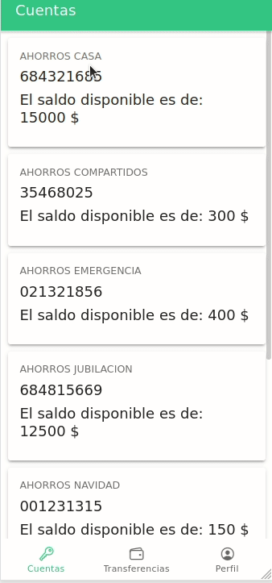
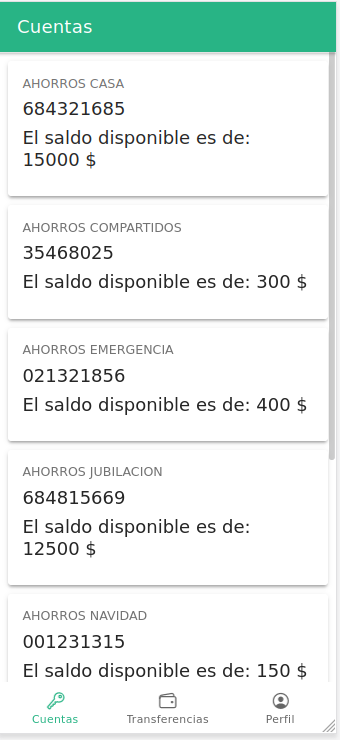

<table align="center"><tr><td colspan="4" align="center" width="9999">

# Billetera digital

Repositorio del Proyecto de Billetera Digital, una nueva experiencia de transferencias

</td></tr></table>

## Tabla de contenido


## Funcionamiento

<p align="center">
  
</p>


El proyecto consta de tres tabs, la primera siendo para
visualizar las cuentas, la segunda para realizar transacciones
y la tercera para ver el perfil de la persona y ver sus últimos movimientos.

Dentro de tabs/cuentas observaremos las cuentas que poseemos en la base de datos

<p align="center">
  
</p>

Dentro de tabs/transferencias observaremos un formulario para realizar transacciones.
<p align="center">
  
</p>


Dentro de tabs/perfil visualizaremos nuestro perfil y nuestros ultimos movimientos registrados.
<p align="center">
  
</p>


## Requisitos

* [Node v13.9.0 o reciente](https://nodejs.org/es/)
* Angular 12
* Ionic Framework Angular 5 o posterior
* Ionic CLI 6 o posterior

## Instalación

Clonar el repo
```bash
git clone https://github.com/FernandoCutire/billetera-digital-frontend
```

Entrar a la carpeta
```bash
# Instalar las dependencias/librerías
$ cd billetera-digital-frontend
```

Instalar las dependencias 
```bash
# Instalar las dependencias/librerías
$ npm install
```

Inicializar el proyecto
```bash
# Inicializar ionic/angular
$ npm run start
```
Una vez inicializado el proyecto podremos verlo en: [http://localhost:4200/](http://localhost:4200/)

## Entidades

Dentro de este proyecto en la carpeta src/app/shared
se encuentra las dos clases que componen este proyecto.

En el archivo src/app/data/data.json se encuentra datos
que pueden subirse directo a la Firebase Real Time Database
para poder ser llamados desde aquí.

### Account
Representa la cuenta de el usuario, posee atributos como
- Nombre  de  cuenta: El nombre de la cuenta en cadena
- Numero  de cuenta: El identificador de la cuenta 
- Saldo disponible: El saldo actual de la cuenta

Ejemplo
```json
{
  "accounts": {
    "AHORROS_NAVIDAD": {
      "nomCuenta": "AHORROS NAVIDAD",
      "numCuenta": "001231315",
      "saldoDisponible": "150"
    },
    "AHORROS_EMERGENCIA" : {
      "nomCuenta": "AHORROS EMERGENCIA",
      "numCuenta": "021321856",
      "saldoDisponible": "400"
    }
  }
}
```
### Transactions
Representa las transacciones entre cuentas llevadas a cabo por usuario, posee atributos como
- cuentaOrigen: La cuenta desde donde se trasnfiere el monto.
- cuentaDestino: La cuenta a la que se le transfiere el monto.
- monto: el dinero que se trasnfiere

Ejemplo
```json
{
  "transactions": {
    "TRANSACCION_CORRI_EMER": {
      "cuentaOrigen": "CUENTA_CORRIENTE",
      "cuentaDestino": "AHORROS_EMERGENCIA",
      "monto": 80
    },
    "TRANSACCION_CORRI_VAC": {
      "cuentaOrigen": "CUENTA_CORRIENTE",
      "cuentaDestino": "AHORROS_VACACIONES",
      "monto": 70
    }
  }
}
```


## Tecnologías

El proyecto usa las siguientes librerias:

1. Ionic/Angular
2. Firebase
3. Sass

### Formato de commits

[ícono] [tipo de commit]: [mensaje] - [descripción]

`🐛 FIX: Mensaje - Arreglo de bug`

`🚀 RELEASE: Mensaje - Nueva versión a producción`

`📖 DOC: Mensaje - Documentación`

`👌 IMPROVE: Mensaje - Mejora de alguna funcionalidad`

`📦 NEW: Mensaje - Nueva característica añadida`

`🧪 TEST: Mensaje - Test generado`

`⚙️ PROGRESS: Mensaje - Se utiliza para hacer save-point`

`🌠 MERGE: Mensaje - Se unen ramas de git`

## Contacto
Aplicante: [Fernando Cutire](https://github.com/FernandoCutire/)
